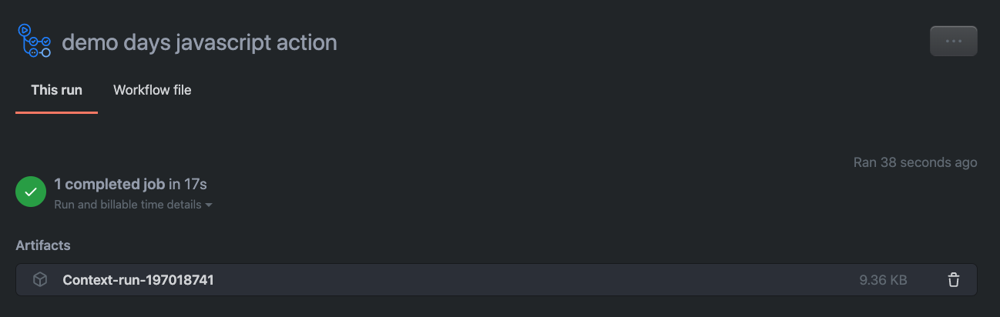
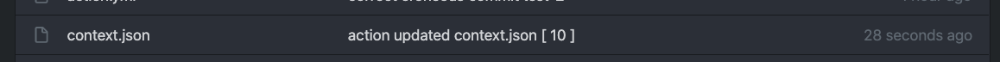
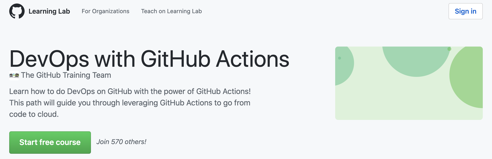

# Browser Camera Action

- [x] TODO insert demo days logo
- [x] Make a badge for our action
- [ ] publish our action to the market place

Heres the plan ... we have about an hour

- Build a javascript action
- Write a file to the runner filesystem
- Upload a "build" artifact from our action
- use git command from within a workflow<sup>*</sup>
- use the `octokit-rest.js` wrapper to call the GitHub API from our action 
- _extension task_ add cat pictures with live share™ audience participation (possible prize :gift: )

#### <a alt="Too Long; Don't Read;">TL;DR;</a>

We will be building a GitHub Action using javascript (node.js) and interacting with various pieces of functionality exploring some of the art of the possible, If all goes well and hurricane ISAIAS hasn't taken out the power :zap: :boxing_glove: then I'll be showing off GitHubs new Cloud Development Environment otherwise known as **codepsaces**

I'm working on the theory that most folk's attending the live twitch are familiar with `git` and :octocat: GitHub, and that most folks are :cool: with **creating branches, creating and merging pull requests** and not :fearful: a little command-line git

I'll be working from a  Mac but you can run follow along on a system of your choice - if you are lucky enough to be part of the codespaces beta - you can even try following along with just a tablet ... ( a phone might be a little ambitious and a sub-optimal experience)

:mega: :bangbang: - If you are planning on coding along then you will need to set up your environment with some tools see [code along resources](#Code-Along-Resources)

---

Steps we're going to attempt

**Step 1. A simple workflow...**

- [ ] Create a new GitHub Repository and initialize with a README.md
- [ ] Add our initial workflow (it will run our action) ... we'll need a few things
   - [ ] A workflow file `.github/workflow/main.yml`
   - [ ] let's run with just a `script` to :mega: `echo` first 

:information_source: now is a good time to discuss actions basics, eco-system and some of the cool extensions in CDE/Codespace  
Also the amazing eco-system of actions for all manor of things that already exists 

<details><summary>snippets</summary>

.github/workflows/main.yml
```yml
name: demo days javascript action
on: 
  push:
    branches:
      - 'test*' 
jobs:
  hello-world-job:
    runs-on: ubuntu-latest
    steps:
      - name: hello world
        run: | 
          echo "hello world"
```
</details>

<br>

**Step 2. - Building on Step 1. with javascript and index,js**

- [ ] install our @actions/core and @actions/github packages
- [ ] An `action.yml` that describes our action
- [ ] Add Some code to `index.js` that doesn't ... break stuff ... `console.log("hello")`
- [ ] Run `npm ci` - we will need to check in the modules 
- [ ] turn on actions debugging :secret: `ACTIONS_STEP_DEBUG` set to `TRUE`
- [ ] log out the event context and see what's there
- [ ] the ubiquitous `hello-world`

<details><summary>snippets</summary>
<br>

**initialise node and install node dependencies**
``` sh
npm init -y

npm install @actions/core
npm install @actions/github
```

**index.js**
```js
const core = require('@actions/core');
const github = require('@actions/github');

async function run (){ 
  try {
    console.log(`hello ghdd participant handle on twitch!`);

    // the github.context provides all of the information you might want to know 
    // about the event that triggered the workflow and the user that instigated the event 
    
    const context = github.context;

    // it's a json payload so we can simply use JSON.stringify to output to the console
    // JSON.stringify(context, undefined, 2) will format nicely for our output rather than
    // JSON.stringify(context)

    console.log(JSON.stringify(context, undefined, 2));
  } 
  catch (error) {
    // this will bubble our error message up into the UI 
    core.setFailed(error.message);
  }
}

run();
```
**.github/workflows/main.yml**
```yml
name: demo days javascript action
on: 
  push:
    branches:
      - 'test*'
jobs:
  hello-world-job:
    runs-on: ubuntu-latest
    steps:
      - name: checkout
        uses: actions/checkout@v2
      - name: Our Javascript Action
        uses: ./
```

a yaml descriptor for our action
```yml
name: 'action for light hearted issue ops'
description: 'mostly about cats, dogs and fortune cookies'

runs: 
  using: 'node12'
  main: 'index.js'  ## note you CAN use a dist instead of uploading your node_modules™
```
</details>

<br>
good time to talk about secrets, vaults integration, and some security considerations

<br>

**step 3. Upload an artifact**  
We will be using the node module specifically built for this 
https://github.com/actions/upload-artifact 
- [ ] write the context information to file (standard IO)
- [ ] import the actions artifact (require) 
- [ ] trigger the action and download our artifact 

You should see something like this in your actions run

 

<details><summary>snippets</summary>

**index.js**
```js
const core = require('@actions/core');
const github = require('@actions/github');
const artifact = require('@actions/artifact');
const fs = require('fs');

async function run () {
  try {    

    //get the github context (core)
    const context = github.context;
    
    // log context eventName - this is what caused the action to run
    console.log(`Processing event : ${context.eventName}`)

    // we probably don't need this in here anymore but 
    console.log(`hello ghdd participant handle on twitch!`);

    // first write the file to the working directory 
    fs.writeFileSync('context.json', JSON.stringify(context, undefined, 2));

    // now create an artifactClient
    const artifactClient = artifact.create();
    // choose the files -> array of filenames (standard fs path things work here too)
    const files = ["context.json"];
    // specify the rootdirectory 
    const rootDir = ".";
    // if the artifact is non-essential - don't fail
    const options = {
      continueOnError: true
    }
    // upload the artifact with a parameterized name - in this case incorporating the run Id
    const artifactInfo = await artifactClient.uploadArtifact(`Context-run-${context.runId}`,files, rootDir, options);

    console.log("artifact uploaded");
    // log out the response from the Artifact create operation
    console.log(JSON.stringify(artifactInfo, undefined, 2));

  } catch (error) {
    core.setFailed(error.message)
  }
 }

run();

```

**install @actions/artifact package**
``` sh
npm install @actions/artifact
# optionally do a clean install with npm ci
npm ci
# use git status to ensure you have the required package 
git status
```
---

example  outut from `git status`
``` bash
Untracked files:
  (use "git add <file>..." to include in what will be committed)
	node_modules/.bin/
	node_modules/@actions/artifact/
	node_modules/@types/tmp/
	node_modules/balanced-match/
	node_modules/brace-expansion/
	node_modules/concat-map/
	node_modules/fs.realpath/
	node_modules/glob/
	node_modules/inflight/
	node_modules/inherits/
	node_modules/minimatch/
	node_modules/path-is-absolute/
	node_modules/rimraf/
	node_modules/tmp-promise/
	node_modules/tmp/

``` 

</details>
<br>

**Step 4. Adding files to the repo** 
- [ ] add a `run` job to our existing action
- [ ] use some simple commands to set up our git client and push some code 
- [ ] go see our repo 


There may be times when we want to add files that were generated and commit them into the repository.
We can do that by simply using git from the shell in our runner

**update our workflow with some good ole `CLI` git <sup>which is not the same as git-cli</sup>**
```yml
name: demo days javascript action
on: 
  push:
    branches:
      - 'test*' 
  issues:
    types:
      - opened
      - edited
  issue_comment:
    types:
      - created
      - edited
jobs:
  hello-world-job:
    runs-on: ubuntu-latest
    steps:
      - name: checkout #this checks out our code to the container
        uses: actions/checkout@v2
      - name: Our Javascript Action # this runs our action using the descriptor in action.yml
        uses: ./
      - name: write context info  # this runs git commands on the commandline 
        run: | 
          git config user.name ${{ github.action }}
          git config user.email no-reply@example.com
          git config advice.addIgnoredFile false ## this silences warnings if you are trying to push excluded files
          git add -f context.json
          git commit -am "action updated context.json [ ${{ github.run_number }} ] "
          git push 
```

**you should now see the file in the list on your test branch**



---


**Step 5 - interacting with the GitHub API** 

Github has a pretty awesome API! it also has some super convenient wrappers namely 

[The Octokit ](https://github.com/octokit)

We will be working with the javascript wrapper but there are others including `.net` and `ruby`

Specifically in this step we are going to mess around with issues and issue comments (handled differently FYI) - we will use the octokit client in our index.js and interact with new and edited issues.

:information_source: :warning:
Issue events (and certain other events) only trigger workflow runs on the default branch. You may observe me force pushing to the default branch -which is fine for having fun, but obviously you should use a solid code review process like [GitHub Flow](https://guides.github.com/introduction/flow/) :) 

:smiling_imp: Devil in the Detail :smiling_imp:

So we will need to update our workflow file and set our `on: ` parameter to :ear: listen for issue related events.. 

adding this should do the trick - just watch your indentations if in doubt use one the snippet at the end 

``` yaml
  issues:
    types:
      - opened
      - edited
  issue_comment:
    types:
      - created
      - edited
```
now we have told our action to listen for issue events and issue_comment events we can have some fun interacting with our users... 

first lets simply reply with the `context.json` that we've been working with so far - this is not practical, but demonstrates a point :point_left:

we need to update our index.js - lucky for us Octokit-rest.js is incorporated into the @actions/github package :sweat: so we just need a `token` and we are good to go

The GitHub action provides a default token in the workflow run, we are going to access that in the workflow file and pass it as a parameter to our index.js (actions/core), we can then use that token to interact with our repo

**update our action.yml descriptor to require a parameter**
``` yaml
name: 'action for light hearted issue ops'
description: 'mostly about cats, dogs and fortune cookies'

runs: 
  using: 'node12'
  main: 'index.js'  ## note you CAN use a dist instead of uploading your node_modules™

inputs:
  access_token:
    description: github token for API access
    required: true # our action will fail if we don't have a token
```
next 

**pass the default token from the workflow**
``` yml
name: demo days javascript action
on: 
  push:
    branches:
      - master
  issues:
    types:
      - opened
      - edited
  issue_comment:
    types:
      - created
      - edited
jobs:
  hello-world-job:
    runs-on: ubuntu-latest
    steps:
      - name: checkout
        uses: actions/checkout@v2
      - name: Our Javascript Action
        uses: ./
        with:    ##### <---- add a with
          access_token: ${{ github.token }} ##### <----- specify the parameter name - must mach our action.yml
      - name: write context info
        run: | 
          git config user.name ${{ github.action }}
          git config user.email no-reply@example.com
          git config advice.addIgnoredFile false 
          git add -f context.json
          git commit -am "action updated context.json [ ${{ github.run_number }} ] "
          git push
```

and finally ...

you can keep all the other stuff we've done in there ... but if you want to keep things lean, you can strip out anything in your workflow and in your index.js files that you don't want to run ... 

notice that we filter the events - but I double down on that in the code to demonstrate finer conditional processing options.

**update your index.js to interact with issues**

```js
const core = require('@actions/core');
const github = require('@actions/github');
const artifact = require('@actions/artifact');
const fs = require('fs');


async function run () {
  try {    
    const context = github.context;
    
    // log context eventName - this is what caused the action to run
    console.log(`Processing event : ${context.eventName}`)

    // we probably don't need this in here anymore but 
    console.log(`hello ghdd participant handle on twitch!`);

    // first write the file to the working directory 
    fs.writeFileSync('context.json', JSON.stringify(context, undefined, 2));

    // now create an artifact and upload
    const artifactClient = artifact.create();
    const files = ["context.json"];
    const rootDir = ".";
    const options = {
      continueOnError: true
    }
    const artifactInfo = artifactClient.uploadArtifact(`Context-run-${context.runId}`,files, rootDir, options);

    console.log("artifact uploaded");
    console.log(JSON.stringify(artifactInfo, undefined, 2));

    // we can also put information back into issues and prs.. 
    // issue as an example 

    // we will need our PAT to interact with issue - the workflow passes in the token we need
    const myToken = core.getInput("access_token");
    
    // once we have a token we can create an authenticated API-client or :) octokit !!
    const octokit = github.getOctokit(myToken);
    

    // check if it is an issue we are working with - it could be another type of event!
    // the payload will change based on the event type so need to be careful matching things up.
    // in our case we are looking to interact only if the event is an issue creation or a comment on an open issue.
    // we want to ignore comments added to closed issues and the final "close and comment" button 
    // there's a handy dandy property called `state` that can help with this :) 

    if(('issues' == context.eventName || 'issue_comment' == context.eventName) && 
    (context.payload.issue.state == "open")) {
      console.log('creating new issue comment via the api')

      // create the body of the comment that we want to add to our issue thread
      // we can include markdown, a subset of html - just as if you were writing an issue comment :)
      //n.b. line-split in a string `\` at the end of the line 

      var commentBody = 
        `Context of the event that triggered the action run \n\n\`\`\`json\n\
        ${JSON.stringify(context, undefined, 2)}\n\`\`\`` 

      // construct the parameters to create issue comment with - check the octokit-rest.js documention for samples and details
      const issueComment = 
      {
        "owner" : context.repo.owner,
        "repo" : context.repo.repo,
        "issue_number" : context.issue.number,
        "body" : commentBody
      };

      // hit the big red button and create that issue comment 
      await octokit.issues.createComment(issueComment);
    }
    else {
      console.log(`not supporting ${context.eventName} at this time .. thank you :)`);
    }
  } catch (error) {
    core.setFailed(error.message)
  }
 }

run();

```


Once you have committed your changes you should ensure that we **merge the changes into our default branch** - if we don't do this then issue events won't be processed ... as they only trigger workflows on the default branch.

Go ahead, create a new issue and see if you
a) trigger the workflow
b) Get some data played back in an issue comment. 

<details open><summary>If we have time for a quick dad joke or two we can try this :)</summary>

**update your index.js**

```js
const core = require('@actions/core');
const github = require('@actions/github');
const artifact = require('@actions/artifact');
const fs = require('fs');
const dadJoke = require('./dadjoke.js');

async function run () {
  try {    
    const context = github.context;
    
    // log context eventName - this is what caused the action to run
    console.log(`Processing event : ${context.eventName}`)


    // we can also put information back into issues and prs.. 
    // issue as an example 

    // we will need our PAT to interact with issue - the workflow passes in the token we need
    const myToken = core.getInput("access_token");
    
    // once we have a token we can create an authenticated API-client or :) octokit !!
    const octokit = github.getOctokit(myToken);
    

    // check if it is an issue we are working with - it could be another type of event!
    // the payload will change based on the event type so need to be careful matching things up.
    // in our case we are looking to interact only if the event is an issue creation or a comment on an open issue.
    // we want to ignore comments added to closed issues and the final "close and comment" button 
    // there's a handy dandy property called `state` that can help with this :) 

    if(('issues' == context.eventName || 'issue_comment' == context.eventName) && 
    (context.payload.issue.state == "open")) {
      console.log('creating new issue comment via the api')

      // create the body of the comment that we want to add to our issue thread
      // we can include markdown, a subset of html - just as if you were writing an issue comment :)
      //n.b. line-split in a string `\` at the end of the line 

      var commentBody = await dadJoke.getJoke();
      var body = null;
        switch(context.eventName) {
          case "issues" : 
            body = context.payload.issue.body; 
            break;
          case "issue_comment" :
            body = context.payload.comment.body;
            break;
          default: 
            throw new Error("Unsupported Event type in issue-ops")
        }

      if(body.includes('/cat')) {
          commentBody = commentBody + '\n' + '';
      }
      // construct the parameters to create issue comment with - check the octokit-rest.js documention for samples and details
      const issueComment = 
      {
        "owner" : context.repo.owner,
        "repo" : context.repo.repo,
        "issue_number" : context.issue.number,
        "body" : commentBody
      };

      // hit the big red button and create that issue comment 
      await octokit.issues.createComment(issueComment);
    }
    else {
      console.log(`not supporting ${context.eventName} at this time .. thank you :)`);
    }
  } catch (error) {
    core.setFailed(error.message)
  }
 }

run();
```

**and add the following file as `dadjoke.js`**

``` js

const axios = require('axios')


module.exports.getJoke = async () =>  {
    try {
        
        let res = await axios
          .get('https://icanhazdadjoke.com/', {
            headers: {
              Accept: 'application/json'
            }
          })
        if(res.status ==200) {
            console.log(res.status)
        }
        return res.data.joke
      } catch (error) {
        console.log(error.message)
      }
} 

```

**we will need to run `npm ci` to pick up the axios package - then commit and push**
``` sh
npm ci

git add .

git commit -m "update with dadjoke and cat picture integration"

git push  ## best practice would be to do this on a branch that ISN'T default :)
```

Now when you create an `issue` or add a comment to an existing one you should have an entirely different experience

</details>

## Code Along Resources

- This repository for starters :)
- [VSCode Download](https://code.visualstudio.com/download)
- [GitHub signup - just in case you don't have one yet](https://github.com/join)
- [node and npm - for your OS](https://www.npmjs.com/get-npm) - unless you have codespaces of course ;) **version 12.x.x**
- [Online Git Reference](https://git-scm.com/doc) - for the curious and the studious
- [GitHub Emojis](https://github.com/onmyway133/emoji) You'll probably want to lighten the mood a little :moon::sparkles::sunrise::coffee:
- [Mastering Markdown](https://guides.github.com/features/mastering-markdown/) ... in case documentation is your thing 

helpful tip for codespaces


This command will list out vs-code extensions in the format required by codespaces devcontainer.json
``` sh
ls -1 | sed 's/-[0-9\.]*$//'
```

and generate for json 

``` sh
ls -1 ~/.vscode-remote/extensions | sed 's/-[0-9\.]*$//' | sed 's/\(.*\)/"\1",/'
```

thanks @jkeech for this :gem: 


---

### :information_source: Information, Docs, Tutorials and More


- [Code Spaces](https://github.com/features/codespaces/?utm_source=outreach&utm_medium=social&utm_campaign=organic-social-&utm_content=DemoDayActions)  - GitHub CDE (Cloud Development Environment)  (_not Cutest Dog Ever_))
  - sign up for the Beta on :point_up: on this page
  - see [documentation](https://docs.github.com/en/github/developing-online-with-codespaces?utm_source=outreach&utm_medium=social&utm_campaign=organic-social-&utm_content=DemoDayActions) on GitHub Docs
  - dotFiles [for codespaces](https://docs.github.com/en/github/developing-online-with-codespaces/personalizing-codespaces-for-your-account?utm_source=outreach&utm_medium=social&utm_campaign=organic-social-&utm_content=DemoDayActions) or for everything GitHub [:heart: ~/.](https://dotfiles.github.io/?utm_source=outreach&utm_medium=social&utm_campaign=organic-social-&utm_content=DemoDayActions) - and yes - the :heart: emoji is a hyperlink  
- GitHub Actions 
  - Actions intro and [help docs on GitHub Docs](https://docs.github.com/en/actions?utm_source=outreach&utm_medium=social&utm_campaign=organic-social-&utm_content=DemoDayActions)
  - [Creating Actions](https://docs.github.com/en/actions/creating-actions?utm_source=outreach&utm_medium=social&utm_campaign=organic-social-&utm_content=DemoDayActions)
  - [Official GitHub Tutorial for JavaScript Action](https://docs.github.com/en/actions/creating-actions/creating-a-javascript-action?utm_source=outreach&utm_medium=social&utm_campaign=organic-social-&utm_content=DemoDayActions)
  - [Workflow Syntax Documentation](https://docs.github.com/en/actions/reference/workflow-syntax-for-github-actions?utm_source=outreach&utm_medium=social&utm_campaign=organic-social-&utm_content=DemoDayActions)
  - [Actions Toolkit Library](https://github.com/actions/toolkit?utm_source=outreach&utm_medium=social&utm_campaign=organic-social-&utm_content=DemoDayActions) 
  - [Actions API (v3)](https://developer.github.com/v3/actions/?utm_source=outreach&utm_medium=social&utm_campaign=organic-social-&utm_content=DemoDayActions)
  - [Tools included on hosted runners](https://docs.github.com/en/actions/reference/software-installed-on-github-hosted-runners?utm_source=outreach&utm_medium=social&utm_campaign=organic-social-&utm_content=DemoDayActions)
  - [Metadata syntax for actions](https://docs.github.com/en/actions/creating-actions/metadata-syntax-for-github-actions?utm_source=outreach&utm_medium=social&utm_campaign=organic-social-&utm_content=DemoDayActions)

- GitHub API 
  - [Developer Documentation](https://developer.github.com/?utm_source=outreach&utm_medium=social&utm_campaign=organic-social-&utm_content=DemoDayActions) V3 and V4 (GraphQL for those who like living on the "edge")
  - [Octokit](https://github.com/octokit?utm_source=outreach&utm_medium=social&utm_campaign=organic-social-&utm_content=DemoDayActions) and  [octokit/rest.js](https://github.com/octokit/rest.js/?utm_source=outreach&utm_medium=social&utm_campaign=organic-social-&utm_content=DemoDayActions) wrapper for GitHub API
  - **hot off the press** the [actions workflow usage endpoints](https://developer.github.com/changes/2020-05-15-actions-api-workflow-usage/?utm_source=outreach&utm_medium=social&utm_campaign=organic-social-&utm_content=DemoDayActions)

And if I really did a terrible job today - and you'd rather __not speak to a human__

- Actions learning lab - practical bot driven tutorial  


